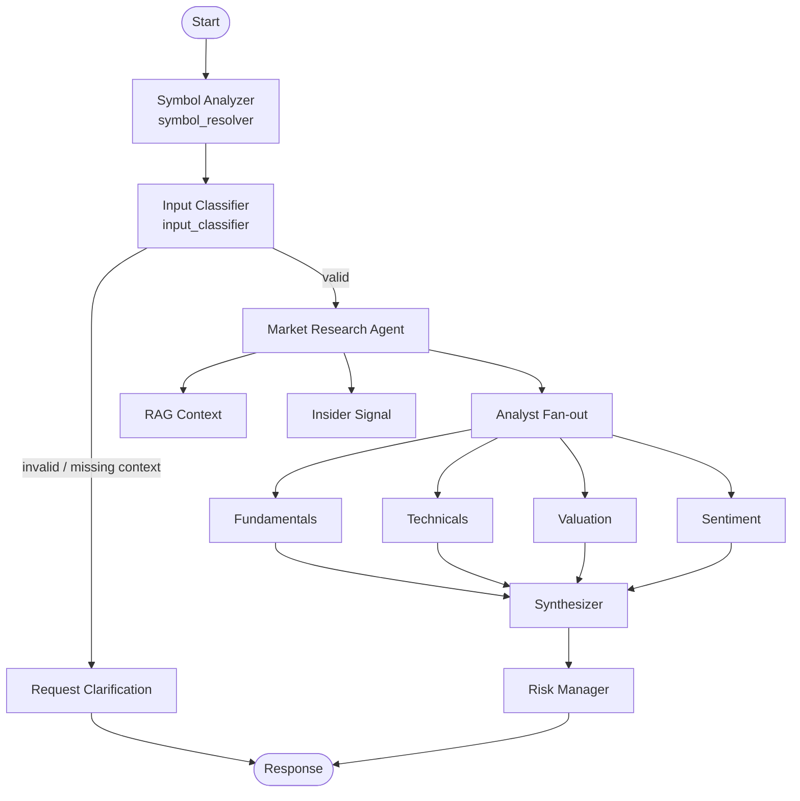

# Primer Studio

[](https://github.com/nadzic/primer-studio/actions/workflows/ci.yml)
[](https://veritake.ai)


An AI-native, multi-agent research assistant for stock trade ideas.

Hosted app: [https://veritake.ai](https://veritake.ai)

The project turns one user prompt into a structured signal by combining:
- analyst-specialized agents,
- retrieval-augmented market context,
- risk constraints,
- and a production-style API + frontend.

## Portfolio Overview

### Problem

Retail-style stock analysis is often fragmented: one tool for charts, another for news, another for valuation, and no consistent risk layer.

### Solution

This project provides a single pipeline that:
1. understands and validates user intent,
2. gathers context (RAG + insider signals),
3. runs multiple analyst agents in parallel,
4. synthesizes a final recommendation,
5. enforces risk thresholds before returning output.

### Why it is interesting

- Multi-agent orchestration with clear node boundaries (`LangGraph`).
- Retrieval + tool-augmented reasoning in one flow.
- End-to-end system design (backend, frontend, voice input, CI).
- Practical API contract and reproducible local environment.

## What I Built

### Backend intelligence pipeline

- `symbol_resolver` infers/normalizes ticker symbol from user input.
- `input_classifier` validates query, symbol and horizon.
- `request_clarification` returns graceful no-trade + explanation for bad inputs.
- `market_research_agent` enriches state with:
  - RAG context from indexed documents,
  - insider-trading summary signal.
- Analyst fan-out nodes:
  - fundamentals,
  - technicals,
  - valuation,
  - sentiment.
- `synthesizer` combines analyst outputs into one proposal.
- `risk_manager` clamps/guards final output using risk limits.

### Product-facing features

- FastAPI endpoints for research, RAG query, and ingestion.
- Metadata endpoint `GET /api/v1/meta/model` for runtime model transparency.
- Next.js chat-style frontend for research workflow.
- Voice dictation + transcription via `POST /api/transcribe` (ElevenLabs proxy route).

## System Flow

`request -> resolve_company -> plan_search -> search_public_sources -> rank_sources -> extract_evidence -> classify_evidence -> select_evidence -> synthesize_brief -> response`



## API Surface

- `GET /api/v1/health`
- `GET /api/v1/meta/model`
- `POST /api/v1/research`
- `POST /api/v1/rag/query`
- `POST /api/v1/rag/ingest-index`

Example research request:

```json
{
  "query": "Please research NVDA"
}
```

Example research response shape:

```json
{
  "company": "NVIDIA Corporation",
  "ticker": "NVDA",
  "brief": {
    "executive_summary": "...",
    "what_changed": [],
    "what_matters_most_now": [],
    "bull_points": [],
    "bear_points": [],
    "what_to_watch_next": []
  },
  "evidence_quality_summary": {
    "strong": 4,
    "medium": 3,
    "weak": 1
  },
  "sources": [],
  "selected_evidence": [],
  "discarded_evidence_count": 8,
  "disclaimer": "This is not investment advice.",
  "warning": null,
  "error": null
}
```

## Tech Stack

### Backend

- Python 3.11
- FastAPI + Uvicorn
- LangGraph / LangChain
- LlamaIndex
- Qdrant
- yfinance + external APIs (optional, key-dependent)

### Frontend

- Next.js 16
- React 19
- TypeScript
- Typed API client for backend workflow integration

### Tooling

- `uv` for Python dependency management
- Docker + Docker Compose
- Ruff + BasedPyright + Pytest
- GitHub Actions CI

## Run Locally

### 1) Backend

```bash
uv sync
uv run uvicorn app.main:app --reload --app-dir .
```

Create `.env` (copy `.env.example` or `sample.env`) and configure at least:
- `OPENAI_API_KEY` (or another configured provider key),
- `LLM_PROVIDER`,
- `LLM_MODEL_NAME`,
- `QDRANT_URL`,
- `ALLOWED_ORIGINS`.

Optional:
- `ANTHROPIC_API_KEY`
- `FINNHUB_API_KEY`
- `LANGFUSE_PUBLIC_KEY`
- `LANGFUSE_SECRET_KEY`
- `RATE_LIMIT_ANON_DAILY` (default `2`)
- `RATE_LIMIT_USER_DAILY` (default `5`)
- `RATE_LIMIT_COOKIE_SECRET` (for signed anonymous guest cookie)

### 2) Frontend

```bash
cd app/frontend
npm install
npm run dev
```

Set `app/frontend/.env.local`:
- `NEXT_PUBLIC_API_URL` (default `http://localhost:8000/api/v1`)
- `ELEVENLABS_API_KEY` (required for voice transcription)

### 3) Full stack with Docker

```bash
docker compose up --build
```

Useful URLs:
- API docs: `http://localhost:8000/docs`
- API health: `http://localhost:8000/api/v1/health`
- Frontend: `http://localhost:3000`
- Qdrant: `http://localhost:6333`

## Project Structure

```text
app/
  agents/
    graph/
      nodes/
    services/
      fundamentals/
      technicals/
      valuation/
      sentiment/
      insider/
  api/
    routes/
    schemas/
  rag/
    ingestion/
    indexing/
    retrieval/
    generation/
    reranking/
    pipelines/
  frontend/
    src/
      app/
      components/
      lib/
```

## Quality

CI checks on push to `main`:
- Ruff lint
- BasedPyright type checks
- Pytest (when tests exist)
- Python compile smoke checks
- Docker build

## TODOs

- Implement jobs, workers, and queues for data ingestion and indexing
- Add fallback models
- Experiment with using smaller models for classification and routing, and reserve larger models for final generation
- Provide a default safe response when API calls fail
- Improve LLM provider orchestration to easily swap models

## Disclaimer

Educational/research project. Not financial advice.
