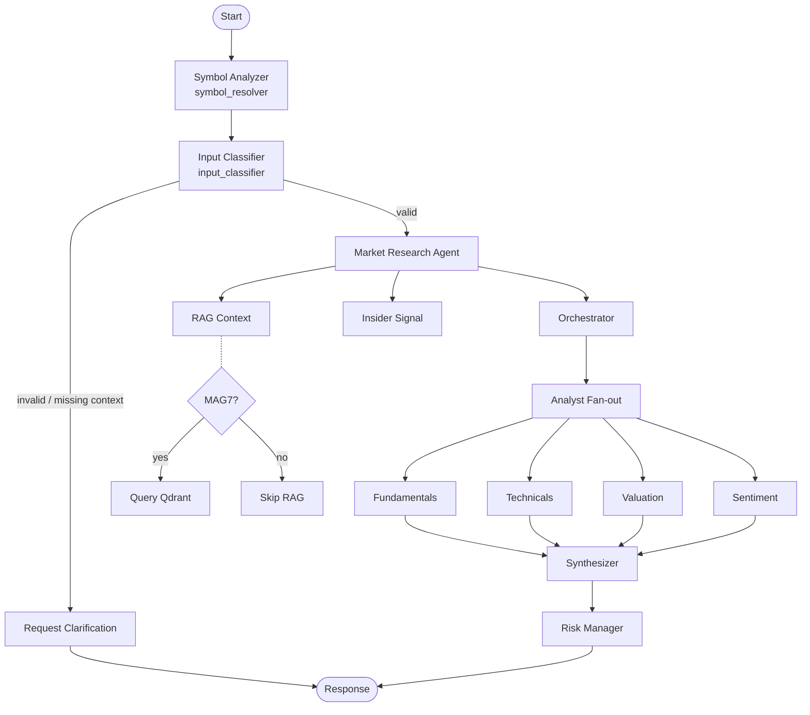

# Agentic Hedge Fund

[](https://github.com/nadzic/agentic-hedge-fund/actions/workflows/ci.yml)
[](https://veritake.ai)


An AI-native, multi-agent research assistant for stock trade ideas.

Hosted app: [https://veritake.ai](https://veritake.ai)

The project turns one user prompt into a structured signal by combining:
- analyst-specialized agents,
- retrieval-augmented market context,
- risk constraints,
- and a production-style API + frontend.

## Portfolio Overview

### Problem

Retail-style stock analysis is often fragmented: one tool for charts, another for news, another for valuation, and no consistent risk layer.

### Solution

This project provides a single pipeline that:
1. understands and validates user intent,
2. gathers context (RAG + insider signals),
3. runs multiple analyst agents in parallel,
4. synthesizes a final recommendation,
5. enforces risk thresholds before returning output.

### Why it is interesting

- Multi-agent orchestration with clear node boundaries (`LangGraph`).
- Retrieval + tool-augmented reasoning in one flow.
- End-to-end system design (backend, frontend, auth, voice input, CI).
- Practical API contract and reproducible local environment.

## What I Built

### Backend intelligence pipeline

- `symbol_resolver` infers/normalizes ticker symbol from user input.
- `input_classifier` validates query, symbol and horizon.
- `request_clarification` returns graceful no-trade + explanation for bad inputs.
- `market_research_agent` enriches state with:
  - RAG context from indexed documents,
  - insider-trading summary signal.
- `orchestrator` creates fan-out analyst tasks and routes them to the correct worker.
- Analyst fan-out nodes (parallel execution via `Send`):
  - fundamentals,
  - technicals,
  - valuation,
  - sentiment.
- `synthesizer` combines analyst outputs into one proposal.
- `risk_manager` clamps/guards final output using risk limits.

### Product-facing features

- FastAPI endpoints for analysis, RAG query, and ingestion.
- Metadata endpoint `GET /api/v1/meta/model` for runtime model transparency.
- Next.js chat-style frontend for analysis workflow.
- Supabase authentication (`/sign-in`, `/sign-up`, OAuth callback).
- Voice dictation + transcription via `POST /api/transcribe` (ElevenLabs proxy route in Next.js).

## System Flow

```
request -> symbol_resolver -> input_classifier -> clarification OR research -> orchestrator -> analyst fan-out -> synthesizer -> risk_manager -> response
```



## API Surface

- `GET /api/v1/health`
- `GET /api/v1/meta/model`
- `POST /api/v1/signals/analyze`
- `POST /api/v1/rag/query`
- `POST /api/v1/rag/ingest-index`

`POST /api/v1/signals/analyze` rate-limit behavior:
- Anonymous users: `2` queries per UTC day
- Authenticated users: `5` queries per UTC day
- Limit exceeded: `429` with metadata (`identity_type`, `limit`, `remaining`, `reset_at`)

Example analyze request:

```json
{
  "query": "Should I buy NVDA for a swing trade?",
  "symbol": "NVDA",
  "horizon": "swing"
}
```

Example analyze response shape:

```json
{
  "symbol": "NVDA",
  "signal": "buy",
  "confidence": 0.74,
  "reasoning": "Condensed synthesis of analyst outputs...",
  "warning": null,
  "error": null
}
```

## Tech Stack

### Backend

- Python 3.11
- FastAPI + Uvicorn
- LangGraph / LangChain
- LlamaIndex
- Qdrant + FAISS
- yfinance + external APIs (optional, key-dependent)

### Frontend

- Next.js 16.2
- React 19.2
- TypeScript
- Supabase SSR client
- Tailwind CSS v4
- Vitest

### Tooling

- `uv` for Python dependency management
- Docker + Docker Compose
- Ruff + BasedPyright + Pytest
- GitHub Actions CI

## Run Locally

### 1) Backend

```bash
uv sync
uv run uvicorn app.main:app --reload --app-dir .
```

Create `.env` (copy `.env.example` or `sample.env`) and configure at least:
- `OPENAI_API_KEY` (or another configured provider key),
- `LLM_PROVIDER`,
- `LLM_MODEL_NAME`,
- `QDRANT_URL`,
- `ALLOWED_ORIGINS`.

Optional:
- `ANTHROPIC_API_KEY`
- `FINNHUB_API_KEY`
- `LANGFUSE_PUBLIC_KEY`
- `LANGFUSE_SECRET_KEY`
- `SUPABASE_URL` (fallback: `NEXT_PUBLIC_SUPABASE_URL`)
- `SUPABASE_ANON_KEY` (fallback: `NEXT_PUBLIC_SUPABASE_ANON_KEY`)
- `SUPABASE_SERVICE_ROLE_KEY` (recommended for backend RPC calls)
- `RATE_LIMIT_ANON_DAILY` (default `2`)
- `RATE_LIMIT_USER_DAILY` (default `5`)
- `RATE_LIMIT_COOKIE_SECRET` (for signed anonymous guest cookie)

### 2) Frontend

```bash
cd app/frontend
npm install
npm run dev
```

Set `app/frontend/.env.local`:
- `NEXT_PUBLIC_API_URL` (default `http://localhost:8000/api/v1`)
- `NEXT_PUBLIC_SUPABASE_URL`
- `NEXT_PUBLIC_SUPABASE_ANON_KEY`
- `ELEVENLABS_API_KEY` (required for voice transcription)

### 2.1) Supabase SQL setup for rate limiting

Run the SQL script in Supabase SQL Editor:

`app/api/supabase_rate_limit.sql`

This creates:
- `public.usage_limits` daily counters table
- `public.check_and_increment_usage_limit(...)` RPC function used by backend

### 3) Full stack with Docker

```bash
docker compose up --build
```

Useful URLs:
- API docs: `http://localhost:8000/docs`
- API health: `http://localhost:8000/api/v1/health`
- Frontend: `http://localhost:3000`
- Qdrant: `http://localhost:6333`

## Project Structure

```text
app/
  agents/
    graph/
      nodes/
        analysts/
        input_classifier.py
        market_research_agent.py
        orchestrator.py
        request_clarification.py
        risk_manager.py
        symbol_resolver.py
        synthesizer.py
    services/
      fundamentals/
      insider/
      llm.py
      sentiment/
      technicals/
      valuation/
  api/
    routes/
      analyze.py
      health.py
      meta.py
      rag_ingest.py
      rag_query.py
    schemas/
  rag/
    ingestion/
    indexing/
    retrieval/
    generation/
    reranking/
    pipelines/
  frontend/
    src/
      app/
        api/transcribe/
        auth/
        sign-in/
        sign-up/
      components/
      lib/
evals/
  datasets/
  rag/generation/
```

## Quality

### CI checks (on push to `main`)

| Job | What it runs |
|-----|-------------|
| **Frontend** | ESLint, `tsc --noEmit`, `next build`, Prettier format check, Vitest tests |
| **Python** | Ruff lint, BasedPyright type check, Pytest, `compileall` smoke check |
| **Evals contract** | Dataset schema validation via `test_generation_dataset_contract_v2.py` |
| **LLM Evals** | Faithfulness, relevancy, correctness (deepeval) — scheduled nightly or manual dispatch |
| **Docker** | `docker build` smoke check (depends on Python + Frontend + Evals) |
| **Deploy** | Build & push to GAR, deploy API + Frontend to Cloud Run (main only) |

### Running checks locally

```bash
# Backend
uv sync --extra dev
uv run ruff check .
uv run basedpyright --level error .
uv run pytest -q

# Frontend
cd app/frontend && npm run lint && npm run typecheck && npm run test

# All at once
./run_ci_checks.sh
```

## Evaluations

LLM-powered quality evaluations live in `evals/`:

- **Contract tests**: Validate dataset schema (run in CI on every push).
- **RAG generation evals**: Faithfulness, relevancy, and correctness scored via `deepeval` — run nightly or on `workflow_dispatch` with `run_llm_evals: true`.

## Deployment

CI automatically deploys to **Google Cloud Run** when merged to `main`:
1. Authenticate via OIDC workload identity federation.
2. Build & push API and Frontend images to Artifact Registry.
3. Deploy each to Cloud Run with secrets injected via Secret Manager.

Environment-specific variables are configured through GitHub Actions vars.

## TODOs

- Implement jobs, workers, and queues for data ingestion and indexing
- Add fallback models
- Experiment with using smaller models for classification and routing, and reserve larger models for final generation
- Provide a default safe response when API calls fail
- Improve LLM provider orchestration to easily swap models

## Disclaimer

Educational/research project. Not financial advice.
